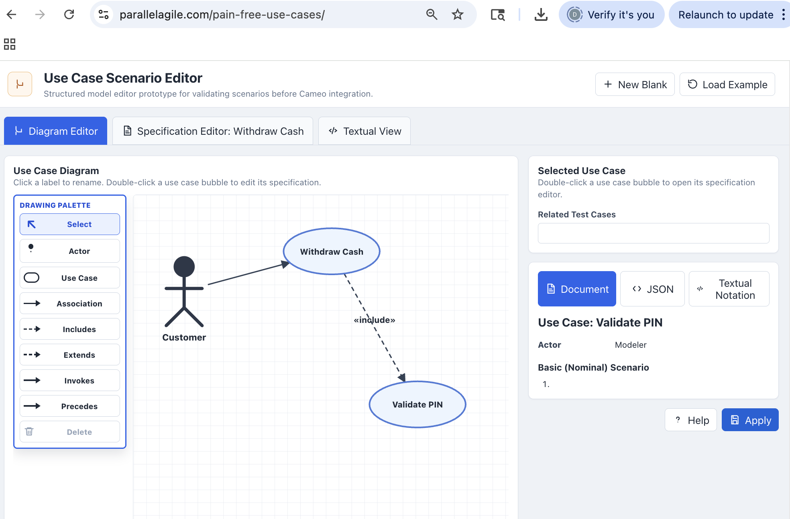

# Structured Use Case Editor

**A lightweight reference implementation for creating structured use case diagrams and specifications.**

The Structured Use Case Editor is an open-source reference implementation for exploring and validating the **Structured Use Cases** approach.

It provides a browser-based environment for creating use case diagrams, editing structured use case specifications, working with basic, alternate, and exception scenarios, and examining the resulting model in both JSON and UCML textual forms.



## Structured Use Cases SysML v2 Library

This editor is a companion reference implementation for the **Structured Use Cases SysML v2 library**.

The library defines the modeling concepts for representing structured use cases in SysML v2. This editor provides a lightweight environment for experimenting with those concepts and the associated editing workflow.

The two projects are intended to complement one another:

**Structured Use Cases library → semantic model**

**Structured Use Case Editor → reference editing environment**

**[Structured Use Cases SysML v2 Library on GitHub](https://github.com/doug-rosenberg/structured-use-cases)**

## What the Editor Does

The editor provides an interactive environment for working with structured use cases.

It supports:

- Creating and editing **use case diagrams**
- Creating **actors and use cases**
- Connecting model elements with use case relationships
- Editing structured **use case specifications**
- Defining **basic, alternate, and exception scenarios**
- Defining ordered **scenario steps**
- Viewing the underlying structured model
- Examining the model in **JSON**
- Examining a textual **UCML representation**

The editor is intended as a reference implementation and experimentation environment rather than a production modeling tool.

## Structured Use Case Specifications

The editor emphasizes the behavioral content of a use case rather than treating the use case diagram as the complete model.

A structured use case specification can describe:

- The use case and participating actors
- The basic or nominal scenario
- Alternate scenarios
- Exception scenarios
- Ordered behavioral steps
- Postconditions associated with different scenarios

This structure helps make system behavior explicit and provides a foundation for requirements discovery and behavioral testing.

## Basic, Alternate, and Exception Scenarios

A central concept of Structured Use Cases is that system behavior should not be limited to the normal path.

**Basic scenarios** describe what normally happens.

**Alternate scenarios** describe legitimate variations in behavior.

**Exception scenarios** describe failures and other off-nominal conditions.

Explicitly capturing these different behavioral paths helps identify requirements that can easily be missed when only nominal behavior is modeled.

## From Structured Use Cases to Behavioral Tests

Structured scenarios provide a natural basis for behavioral testing.

The basic engineering chain is:

**Use Cases → Scenarios → Steps → Test Cases**

Each scenario describes a particular behavioral thread through the system.

Alternate and exception scenarios are especially useful because they expose behavior that frequently becomes a source of defects when it has not been explicitly specified or tested.

Scenario postconditions can also provide expected results that can be checked during testing.

## JSON and UCML

The editor provides multiple representations of the structured model.

The **JSON view** exposes the underlying structured data used by the editor.

The **UCML textual view** provides an experimental textual representation of the same use case information.

These representations make it possible to explore how structured use case information can move between interactive editing environments, textual formats, model repositories, and other engineering tools.

## Running the Editor

The repository includes the source required to run the editor locally.

The primary application entry point is:

`app.py`

A standalone JavaScript implementation is also included:

`standalone-app.js`

The repository source and supporting files can be used to examine, modify, and experiment with the reference implementation.

## Example Deployment

The repository includes an example deployment configuration under:

`deployment/cpanel/`

This demonstrates one way to deploy the Python application using **cPanel and Passenger WSGI**.

The cPanel material is provided as a **sample deployment**, not as a requirement for using the editor.

Other hosting and deployment approaches may be used.

## Repository Structure

```text
structured-use-case-editor/
├── README.md
├── LICENSE
├── app.py
├── standalone-app.js
├── src/
├── images/
│   └── structured-use-case-editor.png
└── deployment/
    └── cpanel/
        ├── README.md
        └── passenger_wsgi.py
